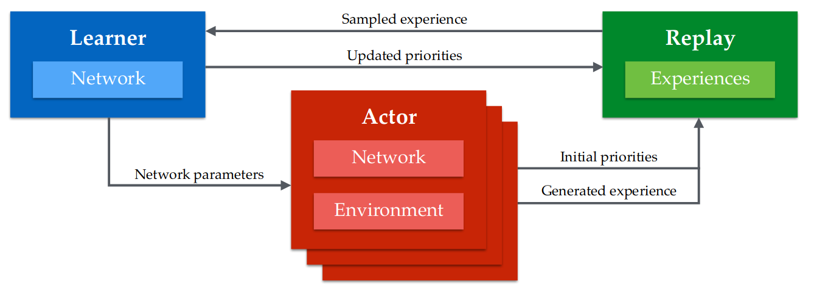

# Deep Reinforcement Learning Algorithms
This repo serves as a companion to [An Overview of Reinforcement Learning](http://probablyexactlywrong/rl). It contains Pytorch implementations of the [DQN](https://storage.googleapis.com/deepmind-media/dqn/DQNNaturePaper.pdf), [DDPG](https://arxiv.org/pdf/1509.02971.pdf) and [PPO](https://arxiv.org/pdf/1707.06347.pdf) (for continuous action spaces) algorithms.

The DQN and DDPG algorithms are implemented in a parallel fashion in the style of [APE-X](https://openreview.net/pdf?id=H1Dy---0Z) with multiple CPU actor processes asynchronously communicating with a single CPU replay buffer process and a single GPU learner process.

## Usage
To run any algorithm, run the command `python agent.py --env <ENV_ID>`.

Run `python agent.py --help` for further information about command line arguments.

## Note on PPO
While it is straightforward to extend the implementation of PPO to be parallel as well, it was found that using decoupled actor processes did not perform very well due to differences in the running mean and standard deviation of the observations and rewards. Solving that by having all actor processes interact with a single process that kept track of the running means and standard deviations worked but caused a communication bottleneck that obviated the advantage of parallelism in the first place. [OpenAI's baseline implementation](https://github.com/openai/baselines) solves this by using lower-level primitives that I chose to avoid for the sake of simplicity.
